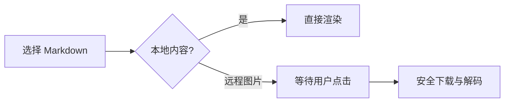
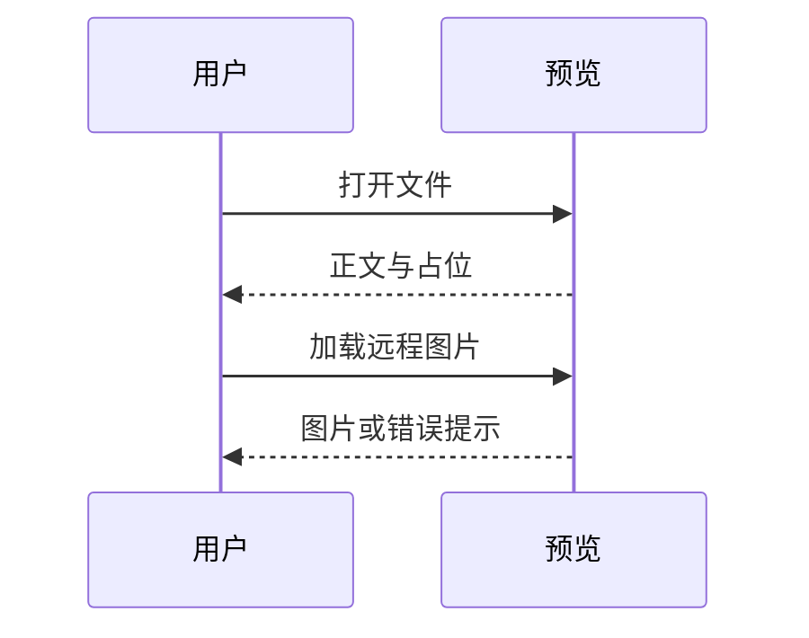
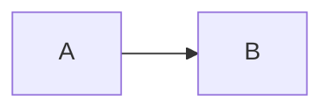

# 公式、图表与图片

普通正文仍可选择复制：中文、English、emoji 👩🏽‍💻。行内公式 $E = mc^2$ 与 $\frac{a+b}{c}$ 应与文字一起排版。

## 块级公式

$$
\int_0^1 x^2\,dx = \frac{1}{3}
$$

$$
\begin{pmatrix} a & b \\ c & d \end{pmatrix}
\quad \sum_{i=1}^{n} i = \frac{n(n+1)}{2}
$$

## Mermaid 流程图

## Mermaid 时序图

## 本地图片

## 远程图片（不会自动联网）

## 安全回归

原始 HTML 只显示，不执行：。

这张图片必须阻止访问：

下面图表包含交互指令，应拒绝渲染，源码仍可查看和复制：

